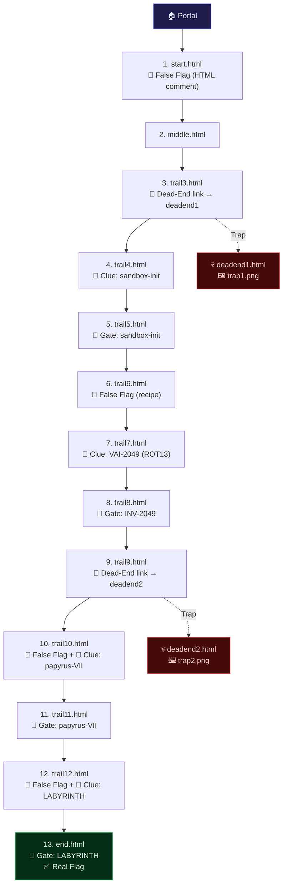

# Redirect Chain CTF — Difficulty Enhancement Plan (v2)

Focused upgrade: 4 false flags, 4 password gates, and 2 dead-end traps — each on a **different page** with zero overlap.

---

## Current Chain (13 pages)

| # | File | Theme |
|---|------|-------|
| 1 | `start.html` | Tech Blog |
| 2 | `middle.html` | Gateway 404 |
| 3 | `trail3.html` | Search Engine |
| 4 | `trail4.html` | Social Profile |
| 5 | `trail5.html` | Terminal Console |
| 6 | `trail6.html` | Recipe Blog |
| 7 | `trail7.html` | Weather Dashboard |
| 8 | `trail8.html` | Payment Checkout |
| 9 | `trail9.html` | Status Monitor |
| 10 | `trail10.html` | AI Chatbot |
| 11 | `trail11.html` | Ancient Book |
| 12 | `trail12.html` | Patch Controller |
| 13 | `end.html` | Decryption Terminal |

---

## Placement Map

Every enhancement is on a **unique page** — no page gets more than one type of addition.

| Page | Enhancement | Details |
|------|------------|---------|
| `start.html` | 🚩 **False Flag** | HTML comment near top |
| `trail3.html` | 🚪 **Dead-End Trap** | Fake profile card → `deadend1.html` |
| `trail5.html` | 🔐 **Password Gate** | Terminal login requires passphrase from `trail4.html` |
| `trail6.html` | 🚩 **False Flag** | Hidden in recipe ingredient list |
| `trail8.html` | 🔐 **Password Gate** | Invoice lookup requires number from `trail7.html` |
| `trail9.html` | 🚪 **Dead-End Trap** | Prominent alert link → `deadend2.html` |
| `trail10.html` | 🚩 **False Flag** | AI chatbot "reveals" a fake flag |
| `trail11.html` | 🔐 **Password Gate** | Manuscript ID input required from `trail10.html` |
| `trail12.html` | 🚩 **False Flag** | Auto-appearing "Patch Complete" modal |
| `end.html` | 🔐 **Password Gate** | Decryption key required from `trail12.html` |

---

## 1. False Flags (4 total)

Each is a convincing but **incorrect** flag that will be rejected by the portal verifier.

| # | Page | False Flag | Hiding Method |
|---|------|-----------|---------------|
| 1 | `start.html` | `FLAG{w3lcome_to_th3_start}` | HTML comment at the top: `<!-- DEBUG: FLAG{w3lcome_to_th3_start} -->`. Visible only in View Source / DevTools. |
| 2 | `trail6.html` | `FLAG{gr4ndm4s_s3cret}` | Listed as a "secret ingredient" in the recipe — styled as a subtle monospace code span inside the ingredient list. |
| 3 | `trail10.html` | `FLAG{a3gis_ai_s3cret}` | The AI chatbot writes this flag in a conversation bubble as if "revealing" the answer. Looks very convincing. |
| 4 | `trail12.html` | `FLAG{p4tch_appl1ed_succ3ss}` | A green "✅ Patch Successfully Applied" modal auto-appears after 3 seconds with this flag displayed prominently. Has a "Copy Flag" button. Dismissing it reveals the real page content underneath. |

---

## 2. Password Gates (4 total)

Each gate blocks page content until the player enters a passphrase found on the **previous** page. This prevents URL-guessing.

### Gate 1 — `trail5.html` (Terminal Console)

| Property | Value |
|----------|-------|
| **Gate type** | Terminal login prompt |
| **Required password** | `sandbox-init` |
| **Where clue is hidden** | `trail4.html` — In NomadCoder's "pinned post", the first word of each sentence spells: **S**ystems **A**re **N**ever **D**own **B**ecause **O**ur **X**-ray **I**nspection **N**ever **I**dles **T**oday → `sandbox-init` (first letters, grouped) |
| **Gate behavior** | Page shows a terminal-style `Password:` prompt with blinking cursor. Wrong password shows `ACCESS DENIED` in red. Correct password reveals the full terminal page with existing clues. |

### Gate 2 — `trail8.html` (Payment Checkout)

| Property | Value |
|----------|-------|
| **Gate type** | Invoice number lookup field |
| **Required password** | `INV-2049` |
| **Where clue is hidden** | `trail7.html` — The severe weather alert's reference number reads `VAI-2049`. This is ROT13 encoded — `VAI` decodes to `INV`. A small note says "All codes are ROT13 secured." |
| **Gate behavior** | Page shows an "Enter Invoice Number to Continue" overlay. Wrong number shows "Invoice not found." Correct number reveals the full checkout page. |

### Gate 3 — `trail11.html` (Ancient Book)

| Property | Value |
|----------|-------|
| **Gate type** | Manuscript ID input field |
| **Required password** | `papyrus-VII` |
| **Where clue is hidden** | `trail10.html` — The AI chatbot says "Let me check archive **papyrus-VII** for that document…" in a conversation message. |
| **Gate behavior** | Page shows a library-style "Enter Manuscript Identifier" field with parchment styling. Wrong ID shows "Manuscript not found in the archives." Correct ID reveals the book content. |

### Gate 4 — `end.html` (Final Decryption Terminal)

| Property | Value |
|----------|-------|
| **Gate type** | Decryption key input |
| **Required password** | `LABYRINTH` |
| **Where clue is hidden** | `trail12.html` — The first letter of each changelog entry spells `LABYRINTH`: **L**ogging subsystem… **A**uthentication module… **B**uffer overflow… **Y**ield optimizer… **R**untime linker… **I**nput sanitizer… **N**etwork stack… **T**LS certificate… **H**eap allocator… |
| **Gate behavior** | The decryption simulator shows "ENTER DECRYPTION KEY" input. Wrong key shows "DECRYPTION FAILED — INVALID KEY." Correct key starts the existing block decryption animation that reveals the real flag. |

---

## 3. Dead-End Traps (2 total)

Each trap is a convincing page with a custom image placeholder. After 10 seconds, a "You've been tricked" overlay appears.

### Trap 1 — `deadend1.html` (linked from `trail3.html`)

| Property | Value |
|----------|-------|
| **Theme** | "Admin Control Panel" — dark hacker dashboard |
| **How player arrives** | `trail3.html` gets an extra fake profile card ("SysAdmin_Root") that links to `deadend1.html` |
| **Content** | Shows a fake admin panel with "Access Level: ROOT" badge, fake system stats. After 10 seconds, an overlay appears with: |
| | - **Custom image placeholder**: `` |
| | - Text: "You fell into the trap! This was a dead end." |
| | - "Return to Trail" button → back to `trail3.html` |

### Trap 2 — `deadend2.html` (linked from `trail9.html`)

| Property | Value |
|----------|-------|
| **Theme** | "Emergency Override Console" — red/amber warning theme |
| **How player arrives** | `trail9.html` gets a prominent flashing "⚠️ CRITICAL: Emergency Override Available" alert bar that links to `deadend2.html` |
| **Content** | Shows a fake emergency console with countdown animation, warning klaxons CSS. After 10 seconds, an overlay appears with: |
| | - **Custom image placeholder**: `` |
| | - Text: "Nice try! This was a decoy route." |
| | - "Return to Trail" button → back to `trail9.html` |

> [!TIP]
> **Adding your custom images**: Place your images at `public/images/trap1.png` and `public/images/trap2.png`. The dead-end pages will reference them from `/images/trap1.png` and `/images/trap2.png`.

---

## Proposed Changes — Per File

### Files to MODIFY (10 files)

---

#### [MODIFY] [App.tsx](file:///c:/Users/admin/Downloads/trail/src/App.tsx)
- Update challenge description to mention password gates, false flags, and dead ends
- Update hint descriptions for pages that now have gates (trail5, trail8, trail11, end)
- Add a warning card about false flags in the challenge briefing

---

#### [MODIFY] [start.html](file:///c:/Users/admin/Downloads/trail/public/start.html)
- Add HTML comment false flag at top: `<!-- DEBUG: FLAG{w3lcome_to_th3_start} -->`
- No other changes — existing clue/trap mechanics stay

---

#### [MODIFY] [trail3.html](file:///c:/Users/admin/Downloads/trail/public/trail3.html)
- Add a fake profile card for "SysAdmin_Root" that links to `deadend1.html`
- Style it to look equally legitimate as the real profile cards
- No other changes

---

#### [MODIFY] [trail4.html](file:///c:/Users/admin/Downloads/trail/public/trail4.html)
- Add a "pinned post" section with sentences whose first letters spell `sandbox-init`
- This is the clue for the gate on `trail5.html`
- No other changes to existing clue/trap mechanics

---

#### [MODIFY] [trail5.html](file:///c:/Users/admin/Downloads/trail/public/trail5.html)
- Add password gate overlay: terminal-style `Password:` prompt
- Content is hidden behind a dark overlay until `sandbox-init` is entered
- Wrong password → red `ACCESS DENIED` text
- Correct password → overlay fades out, reveals existing page

---

#### [MODIFY] [trail6.html](file:///c:/Users/admin/Downloads/trail/public/trail6.html)
- Add false flag `FLAG{gr4ndm4s_s3cret}` as a "secret ingredient" in the recipe list
- Styled as a monospace code span within the ingredient list to look like a hidden code

---

#### [MODIFY] [trail7.html](file:///c:/Users/admin/Downloads/trail/public/trail7.html)
- Change the alert reference number to `VAI-2049` (ROT13 of `INV-2049`)
- Add a subtle note: "All reference codes are ROT13 secured for transmission."
- This is the clue for the gate on `trail8.html`

---

#### [MODIFY] [trail8.html](file:///c:/Users/admin/Downloads/trail/public/trail8.html)
- Add invoice lookup gate overlay: "Enter Invoice Number"
- Content hidden until `INV-2049` is entered
- Wrong number → "Invoice not found in registry."
- Correct number → overlay fades, reveals existing checkout page

---

#### [MODIFY] [trail9.html](file:///c:/Users/admin/Downloads/trail/public/trail9.html)
- Add a prominent flashing "⚠️ CRITICAL: Emergency Override Available" alert bar
- This links to `deadend2.html`
- Styled with red/amber pulsing animation to be tempting to click

---

#### [MODIFY] [trail10.html](file:///c:/Users/admin/Downloads/trail/public/trail10.html)
- Add false flag `FLAG{a3gis_ai_s3cret}` in a chatbot conversation bubble
- Add a new AI message: "Let me check archive **papyrus-VII** for that document…"
- The false flag and real clue are in different chat messages to create confusion

---

#### [MODIFY] [trail11.html](file:///c:/Users/admin/Downloads/trail/public/trail11.html)
- Add manuscript ID gate overlay: parchment-styled "Enter Manuscript Identifier"
- Content hidden until `papyrus-VII` is entered
- Wrong ID → "Manuscript not found in the archives."
- Correct ID → overlay fades, reveals existing book page

---

#### [MODIFY] [trail12.html](file:///c:/Users/admin/Downloads/trail/public/trail12.html)
- Add auto-appearing "Patch Complete" modal after 3 seconds with false flag `FLAG{p4tch_appl1ed_succ3ss}`
- Restructure changelog entries so first letters spell `LABYRINTH`
- This acrostic is the clue for the final gate on `end.html`

---

#### [MODIFY] [end.html](file:///c:/Users/admin/Downloads/trail/public/end.html)
- Add decryption key gate: "ENTER DECRYPTION KEY" input before animation starts
- Wrong key → "DECRYPTION FAILED — INVALID KEY"
- Correct key (`LABYRINTH`) → starts existing block decryption animation
- Real flag `FLAG{y0u_followed_th3_tra1l}` revealed at end as before

---

### New Files (3 files)

#### [NEW] [deadend1.html](file:///c:/Users/admin/Downloads/trail/public/deadend1.html)
- "Admin Control Panel" themed dead-end trap page
- Dark hacker dashboard with fake ROOT access UI
- After 10 seconds: overlay with **image placeholder** (`/images/trap1.png`) + trick message + back button

#### [NEW] [deadend2.html](file:///c:/Users/admin/Downloads/trail/public/deadend2.html)
- "Emergency Override Console" themed dead-end trap page
- Red/amber warning console with countdown animation
- After 10 seconds: overlay with **image placeholder** (`/images/trap2.png`) + trick message + back button

#### [NEW] `public/images/` directory
- Create empty directory for user's custom trap images
- Expected files: `trap1.png` and `trap2.png`

---

## Visual Summary

---

## Image Placeholders

Place your custom "gotcha" images here before deployment:

| File Path | Used In | Dimensions (recommended) |
|-----------|---------|-------------------------|
| `public/images/trap1.png` | `deadend1.html` — Admin Panel trap reveal | 400×300px or larger |
| `public/images/trap2.png` | `deadend2.html` — Emergency Override trap reveal | 400×300px or larger |

The images will be displayed centered inside the trap reveal overlay, above the "You've been tricked!" text.

---

## Verification Plan

### Automated Tests
1. Run `npm run build` — no build errors
2. Run `npm run dev` and walk through the full chain

### Manual Walkthrough
1. **Gates**: Try accessing trail5, trail8, trail11, end directly — verify content is blocked
2. **Gate passwords**: Enter correct passwords — verify content unlocks
3. **False flags**: Submit all 4 false flags in the portal verifier — all should be **rejected**
4. **Real flag**: Submit `FLAG{y0u_followed_th3_tra1l}` — should be **accepted**
5. **Dead ends**: Click trap links on trail3 and trail9 — verify deadend pages load, show image placeholders, reveal trick message after 10s
6. **Existing flow**: Verify all original clues/links still work on unmodified pages
